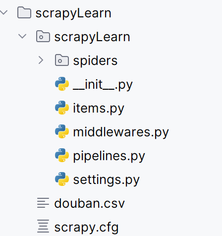

# scrapy study note

## scrapy框架基础介绍
五个组件

## scrapy框架项目基础结构
使用下面的命令创建scrapy项目
```bash
scrapy startproject <项目名>
```
项目由下面几个文件结构组成：
+ __init.py
+ items.py 规定爬取数据的存储格式，可以理解为obiect类
+ middlewares.py 中间件类，组件和组件之间可以使用中间件
+ pipelines.py 写数据和处理数据使用的组件
+ setting.py 在这里进行爬虫的各种设置
+ spiders 这里存储着项目的爬虫



## 一个基础的爬虫
```bash
scrapy genspider <爬虫名>
scrapy crawl <爬虫名> -o <保存文件名>
```
一个基础的爬虫文件需要我们决定爬取数据的url以及其在页面中的位置

+ 请求发起start_request(重写父类方法)：
```python
import scrapy
def start_request(self):
# 我们使用这个函数进行爬虫请求的发送

    # way1：
    urls=[
        'httpxxxxxx',
        'hxxxxx'
    ]
    for url in urls:
        yield scrapy.Request(url=url,callback=self.parse)
    # way2:
    for page in range(10):
        yield scrapy.Request(url=f'http://xxxx?start={page}',callback=self.parse)
```

+ 内容解析parse
```python
import scrapy
def parse(self,response,**kwargs):
    sel = scrapy.Selector(response)
    # 可以使用css选择器+xpath选择等
    list_items = sel.css('#content > div > div.article > ol > li')

    for list_item in list_items:
        movie_item = MovieItem()
        movie_item['title'] = list_item.css('span.title::text').extract_first()
        movie_item['subject'] = list_item.css('span.inq::text').extract_first()
        movie_item['rank']=list_item.css('span.rating_num::text').extract_first()
        yield movie_item
```

我们需要在item文件中规定我们爬取文件的格式,并在spider中导入我们的格式

```python
# in items.py
import scrapy
class MovieItem(scrapy.Item):
    title = scrapy.Field()
    rank = scrapy.Field()
    subject = scrapy.Field()
```

更改setting.py中的useragent也很重要
```python
#Crawl responsibly by identifying yourself (and your website) on the user-agent
# 下面是一个常用的user agent伪装
USER_AGENT = "Mozilla/5.0 (Windows NT 10.0; Win64; x64) AppleWebKit/537.36 (KHTML, like Gecko) Chrome/58.0.3029.110 Safari/537.36"
```

完成以上的步骤后，可以在命令行中运行下面的命令来运行爬虫
```bash
scrapy crawl douban -o douban.csv
```

## pipeline文件

some extra tips：
```bash
pip freeze > requirements.txt
pip install -r requirements.txt
```

### EXCEL存储
当我们想把我们的数据存储到xlsx文件时，我们可以使用pipline文件创造框架的钩子函数来帮助我们进行数据处理。

**常见的钩子函数：**
+ __init__:初始化
+ close_spider: 爬虫关闭后的相关操作
+ open_spider:spider开启时，爬取数据之前的操作
+ progress_item:数据处理函数，每次爬取到相应的数据都会执行一次
  + 在豆瓣数据爬取中，可以理解为每爬到一个电影就会执行一次
```python
import openpyxl #excel相关库


class ScrapylearnPipeline:

    def __init__(self):
        self.wb=openpyxl.Workbook()
        self.ws=self.wb.active
        self.ws.title='豆瓣电影top250'
        self.ws.append(['title','subject','rank'])

    def close_spider(self, spider):
        self.wb.save('电影top250.xlsx')
        
    def open_spider(self,spider):
        pass


    def process_item(self, item, spider):
        # 提前处理防止空值
        title=item.get('title','')
        subject=item.get('subject', '')
        rank=item.get('rank', '')
        
        self.ws.append([title, subject, rank])
        
        # 也可以直接传
        self.ws.append(list(item.values()))
        return item
```

完成了pipeline的书写，还需要修改配置文件,取消注释

```python
# Configure item pipelines
# See https://docs.scrapy.org/en/latest/topics/item-pipeline.html
ITEM_PIPELINES = {
   "scrapyLearn.pipelines.ScrapylearnPipeline": 300,
}
```
当有多个管道时，数值越小优先级越高，数值小的先执行。

### mysql数据库存储

和excel相似，和其他的语言也差不多

```python
import pymysql # mysql库

class MysqlPipeline:
    def __init__(self):
        # 创建连接和游标
        self.conn=pymysql.connect(host='localhost',user='root',password='123456',database='spider')
        self.cursor=self.conn.cursor()

    def close_spider(self, spider):
        self.conn.close()

    def process_item(self, item, spider):
        title=item.get('title', '')
        subject=item.get('subject', '')
        rank=item.get('rank', '')
        
        # 使用游标执行sql语句
        sql="insert into movie(title,subject,rank) values(%s,%s,%s)"
        self.cursor.execute(sql,(title,subject,rank))
        self.conn.commit()
        return item
```

多个管道可以同时使用，但是需要写进配置项中，当被配置时管道才会生效

在进行数据存储时，为避免大量io操作，可以进行批处理，一次爬取多个数据再进行存储
```python
# 批处理
# 位置：

# 格式：
```
## middlewares

中间件有两种类型，一种是spider中间件，一种是下载中间件。

通常我们只修改下载中间件，主要修改其中的请求处理部分：
```python
class ScrapylearnDownloaderMiddleware:
    # Not all methods need to be defined. If a method is not defined,
    # scrapy acts as if the downloader middleware does not modify the
    # passed objects.

    @classmethod
    def from_crawler(cls, crawler):
        # This method is used by Scrapy to create your spiders.
        s = cls()
        crawler.signals.connect(s.spider_opened, signal=signals.spider_opened)
        return s

    def process_request(self, request, spider):
        # Called for each request that goes through the downloader
        # middleware.

        # Must either:
        # - return None: continue processing this request
        # - or return a Response object
        # - or return a Request object
        # - or raise IgnoreRequest: process_exception() methods of
        #   installed downloader middleware will be called
        return None

    def process_response(self, request, response, spider):
        # Called with the response returned from the downloader.

        # Must either;
        # - return a Response object
        # - return a Request object
        # - or raise IgnoreRequest
        return response

    def process_exception(self, request, exception, spider):
        # Called when a download handler or a process_request()
        # (from other downloader middleware) raises an exception.

        # Must either:
        # - return None: continue processing this exception
        # - return a Response object: stops process_exception() chain
        # - return a Request object: stops process_exception() chain
        pass

    def spider_opened(self, spider):
        spider.logger.info("Spider opened: %s" % spider.name)
```
中间件的使用：
+ 修改request cookie
+ 拦截请求并直接返回动态response


中间件也需要进行配置

## 多层次页面读取

核心逻辑是转发request到不同的parse函数中，把超链接跳转的url转发到该页面的解析函数中。

```python
# 传入url，解析函数，也可以通过**kwargs传参
return Response(url=url,call_back=new_parse,cbkwrags=({"item":movie_itme}))
```

## 案例： 爬取淘宝数据

1. 通过浏览器驱动创造browser
2. 登陆后通过浏览器属性捕捉cookie设置cookie
3. 动态内容捕捉通过中间件返回


