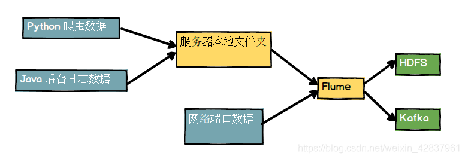
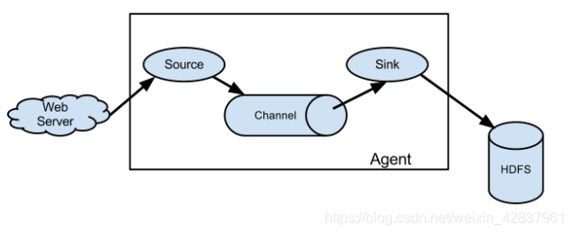

# Flume

## flume简介
感觉可以理解为专用于日志采集的中间件
+ 官方文档：https://flume.apache.org/releases/content/1.9.0/FlumeUserGuide.html
+ 官方下载地址：https://flume.apache.org/releases/index.html

## flume架构
### flume架构图


flume处于一个服务器和大数据集群系统以及前端收发之间的中间位置，是一个数据采集工具，一个java包，用于将数据从不同的数据源收集起来，然后传输到指定的数据存储系统，如HDFS、HBase、Kafka等。




### flume agent

agent是一个JVM进程

+ source
+ channel
+ sink

### flume event

+ event是flume数据传输的基本单位，由header和body组成
+ header是key-value对，用于存储event的元数据
+ body是字节数组，用于存储event的实际数据

### flume source

+ flume source负责从数据源读取数据，并将数据封装成event发送到channel
+ flume source支持多种类型的日志数据，如exec、netcat、spooling directory，http等

+ flume source可以配置多个，以实现多数据源的数据采集

### flume channel
+ flume channel负责在source和sink之间缓存event
+ flume channel支持多种类型，如memory、file、kafka等
+ flume channel可以配置多个，以实现高可用和负载均衡，其实现了线程安全，可以保证多个soure和多个sink的同时访问
+ 两种类型：file和memory

### flume sink

+ flume sink负责将event从channel中取出，并传输到指定的数据存储系统，轮询channel中的event并将其发送到指定的存储系统


### flume interceptor

+ flume interceptor用于在source和sink之间对event进行拦截和处理


### 安装流程
将安装包 apache-flume-1.9.0-bin.tar.gz 上传到 Linux 系统上。
解压安装包到指定目录下
```bash
tar -zxvf apache-flume-1.9.0-bin.tar.gz -C /opt/moudule/
```
重命名
```bash
mv apache-flume-1.9.0-bin flume
```
将 flume/conf 目录下的 flume-env.sh.template 文件修改为 flume-env.sh。
```bash
mv flume-env.sh.template flume-env.sh
```
配置 flume-env.sh 文件，将 LInux 系统的 jdk 的路径写到其中。
```bash
export JAVA_HOME=/usr/local/java/jdk1.8.0_151
```